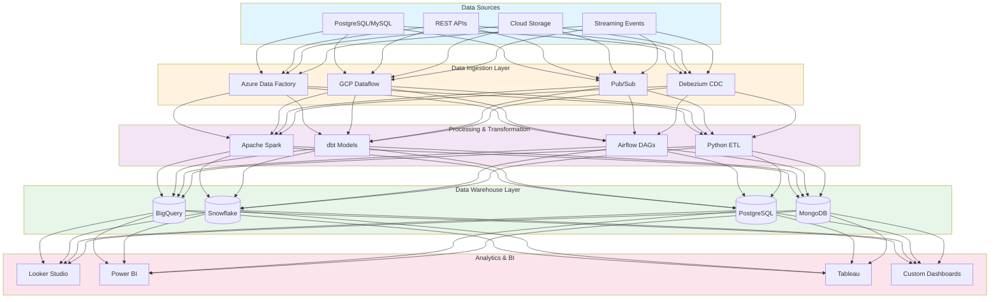
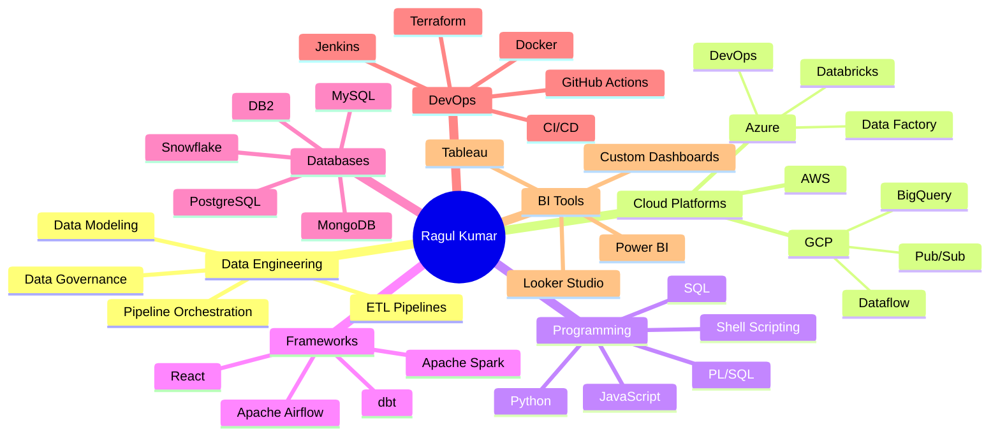
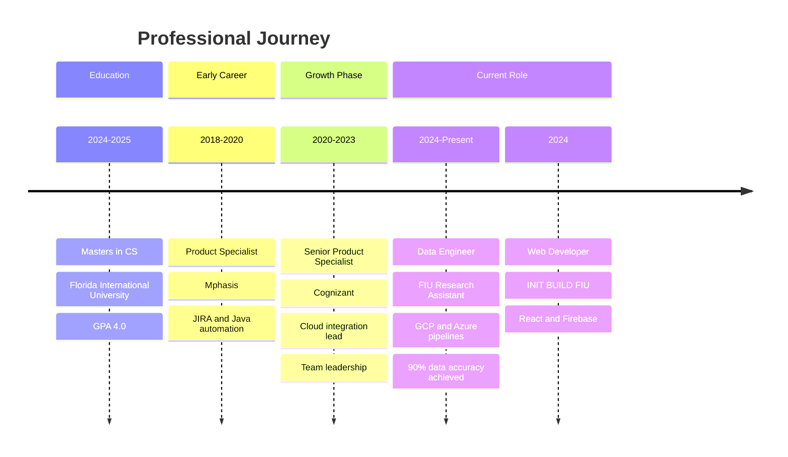

[%20249--2057-25D366?style=for-the-badge&logo=whatsapp&logoColor=white)](tel:+16892492057)

---

## 👨‍💻 Professional Summary

**Data Engineer with 3+ years of experience designing and maintaining scalable data pipelines, models, and BI solutions across GCP, Azure, and Snowflake.**

Skilled in Python, SQL, Airflow, and dbt for data orchestration, ETL automation, and governance. Experienced in translating business requirements into reliable, auditable data products that power analytics, reporting, and self-service exploration. Strong collaborator in Agile teams, delivering trusted, high-performance data systems that drive strategic decision-making.

---

## 🏗️ Data Engineering Architecture

---

## 🎯 Technical Expertise Mindmap

---

## 📊 Career Timeline

---

## 🛠️ Technology Stack

### Programming Languages

### Cloud & DevOps

### Data Engineering Tools

### Databases

### BI & Analytics

### Frameworks & Libraries

---

## 💼 Professional Experience

### 🎓 Florida International University
**Data Engineer - Research Assistant** | *Aug 2024 – Present*

- Built and maintained **ETL pipelines** across GCP BigQuery and Azure Data Factory, integrating multi-source datasets for analytics and reporting
- Designed **dimensional data models** and relational schemas to enhance query performance and ensure data consistency
- Implemented **data governance standards**, automated data quality monitoring, and established audit frameworks, achieving **over 90% data accuracy**
- Partnered with BI engineers, analysts, and researchers to translate business needs into production-grade pipelines and self-service dashboards in Looker Studio and Power BI
- Championed **CI/CD automation** with Azure DevOps and Terraform, improving deployment reliability by **80%**
- Applied dbt and Airflow best practices for version-controlled, orchestrated data workflows ensuring reproducibility and compliance

---

### 🌐 INIT BUILD FIU – Code Zone
**Web Developer** | *Sep 2024 – Dec 2024*

- Architected an **event discovery app** with React and Ticketmaster API, boosting engagement by **20%**
- Built a memory bookmarking system using JavaScript and Cloud Firestore, improving personalization by **40%**
- Integrated **RESTful authentication** and implemented CI/CD pipelines (Jenkins, GitHub Actions)

---

### 💼 Cognizant
**Senior Product Specialist** | *Dec 2020 – Nov 2023*

- Contributed to Ingenium app's cloud integration by modifying modules and testing to ensure **80% efficiency improvement** and seamless API communication
- Led a team of **4** to deliver cross-functional insurance products by designing CICS transaction flows and COBOL modules, increasing client satisfaction by **15%**
- Automated record insertion processes using Java and shell scripts, cutting manual intervention by **90%**, upgrading database scalability, and earning an **automation excellence award**

---

### 🏢 Mphasis
**Product Specialist** | *Jun 2018 – Dec 2020*

- Engineered **20+ business requirements** into JIRA specifications, driving **35% productivity gains** and delivering on-time releases
- Orchestrated **UAT testing**, defect resolution, and performed root cause analysis to resolve data flow issues ensuring **90% on-time delivery**
- Automated web page creation (HTML) in Java, reducing setup time by **50%** and earning team recognition

---

## 🚀 Featured Projects

### 📊 E-Commerce Real-Time Analytics Pipeline

Developed a **real-time streaming pipeline** (Pub/Sub → Dataflow → BigQuery) processing **1M+ daily events** from GA4. Designed semantic data models and built Looker dashboards enabling self-service BI exploration for product and marketing teams. Integrated data validation checks and automated reporting to maintain accuracy and timeliness.

**Impact:** Enabled real-time decision-making for marketing campaigns and product optimization

---

### ☁️ Azure End-to-End Data Engineering

![Databricks](https://img.shields.io/badge/Databricks-FF3621?style=flat-square&logo=databricks&logo